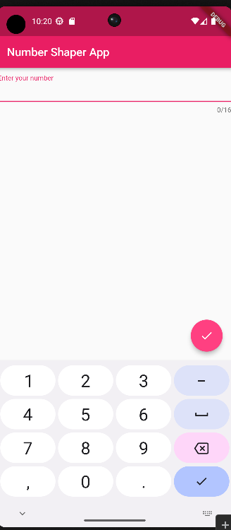
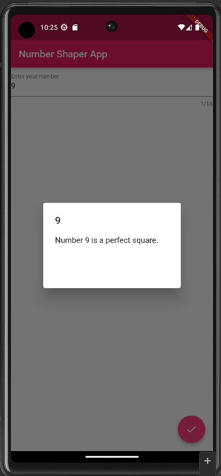
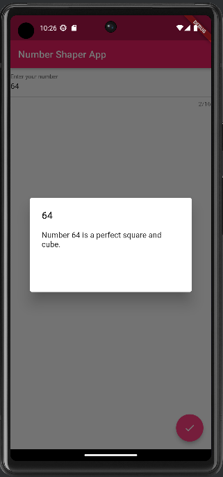
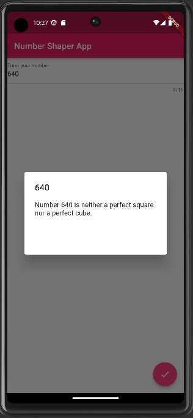

# number_shapes

This is the app that tells you if the number entered is a perfect square, perfect cube, both or neither.
Perks:
    - trims all trailing zeros using regex
    - it accepts digits and decimals only
    - it's paste proof
    - button is disabled if no value is entered

Here are some screenshots:

